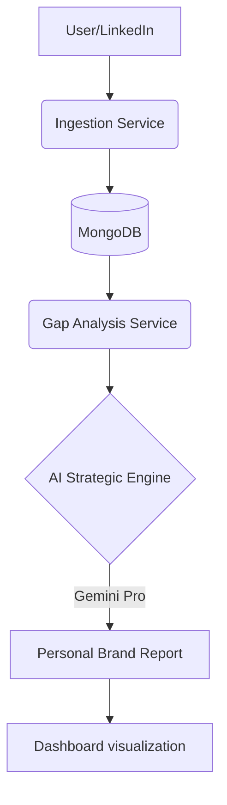
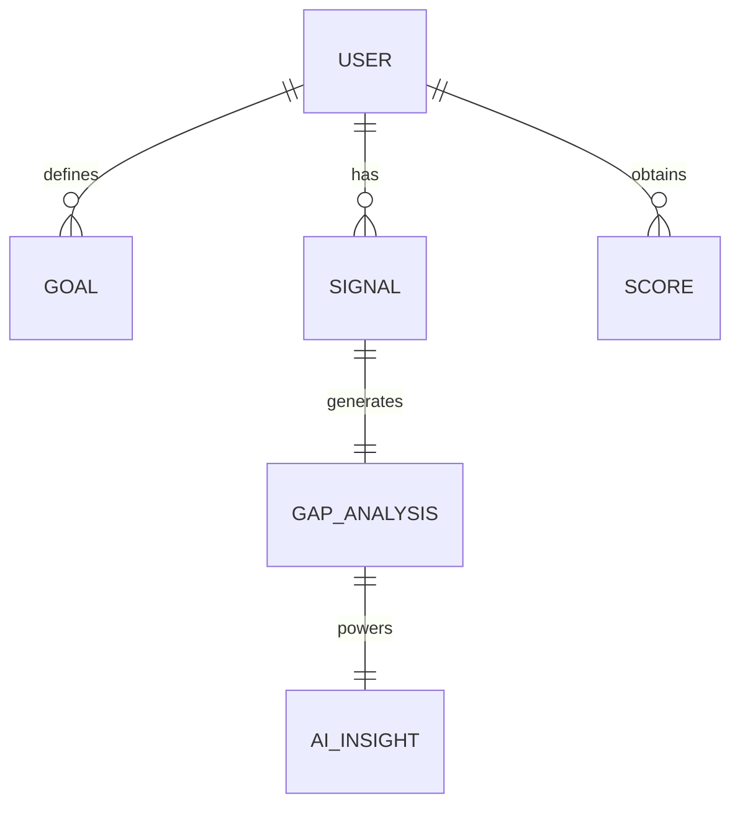

# Parsona
AI-driven personal brand intelligence platform for creators, founders, and professionals.

## Problem
Building a personal brand today is often a "guess-and-check" process. Professionals post content without knowing if it aligns with their career goals or how they compare to industry benchmarks. There is a lack of data-driven feedback on topic authority, consistency, and strategic alignment, making it difficult to turn a social presence into a tangible career asset.

## Solution
Parsona centralizes your branding efforts into a unified dashboard. It analyzes your social signals (currently LinkedIn) to calculate a brand health score, identifies gaps between your current presence and your target persona, and provides AI-generated strategic advice to help you bridge those gaps.

### Key Features
- **Signal Engine**: Analyzes posting cadence, topic variance, and engagement quality.
- **Gap Analysis**: Compares your profile against specific personas (e.g., Founder, CTO, Product Leader).
- **AI Strategic Direction**: Powered by Gemini Pro to provide blunt, mathematical guidance on brand growth.
- **Goal Tracking**: Set and track specific career milestones linked to your brand's data.
- **Responsive Dashboard**: Premium visualization of growth metrics and activity signals.

## Who Is This For
- **Founders**: Looking to build authority and trust in their industry.
- **Professionals**: Aiming to position themselves for leadership roles or career pivots.
- **Creators**: Seeking data-backed insights to optimize their content strategy.

## Guarantees
- **Data Integrity**: Direct analysis of your activity without tampering.
- **Strategic Focus**: Insights are always tied back to your specific career goals.
- **Modern UI**: A fast, premium, and responsive experience.

## Non-Goals
- **Automated Posting**: We don't post for you; we help you decide *what* to post.
- **Engagement Manipulation**: No pods, no bots—just organic growth strategy.
- **General CRM**: Focused strictly on brand intelligence, not lead management.

## Architecture

### System Overview


See the detailed **[Architecture Documentation](./docs/ARCHITECTURE.md)** for more technical depth.

### ER Diagram


## Tech Stack
- **Frontend**: React 19, Vite, Tailwind CSS 4.0, Framer Motion, Recharts.
- **Backend**: Node.js, Express, MongoDB (Mongoose).
- **AI**: Google Gemini API (Generative AI).
- **Payments**: Razorpay Integration.
- **Icons**: Lucide React.

## Project Structure
```text
Parsona/
├── frontend/             # React + Vite application
│   ├── src/components/   # Reusable UI components
│   ├── src/pages/        # Page-level components (Dashboard, Goals, etc.)
│   └── src/context/      # Global state management (Auth)
├── backend/              # Node.js + Express API
│   ├── src/models/       # Mongoose schemas (User, Goal, Signal)
│   ├── src/services/     # Business logic (AI, Scoring, Ingestion)
│   └── src/api/          # API routes and controllers
└── docs/                 # Documentation and architecture assets
```

## Running Locally

## License
MIT License.
