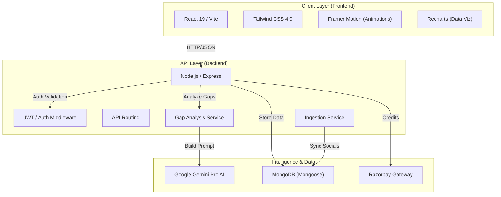

# Parsona System Architecture

Parsona is architected as a modern, decoupled SaaS application leveraging AI for strategic personal brand intelligence.

## Key Components

### 1. Signal Engine
Analyzes raw activity data (LinkedIn) to compute metrics:
- **Consistency**: Frequency and variance of posts.
- **Authority**: Topic focus and industry alignment.
- **Engagement**: Like/Comment ratios and performance trends.

### 2. Gap Analysis Service
Compares current user signals against target persona benchmarks (e.g., "Founder", "CTO"). It identifies the mathematical delta in quantitative metrics.

### 3. AI Strategic Advisor
Uses Gemini Pro to transform raw gap data into actionable, blunt advice. It calculates specific targets the user needs to hit to reach their career goals.
